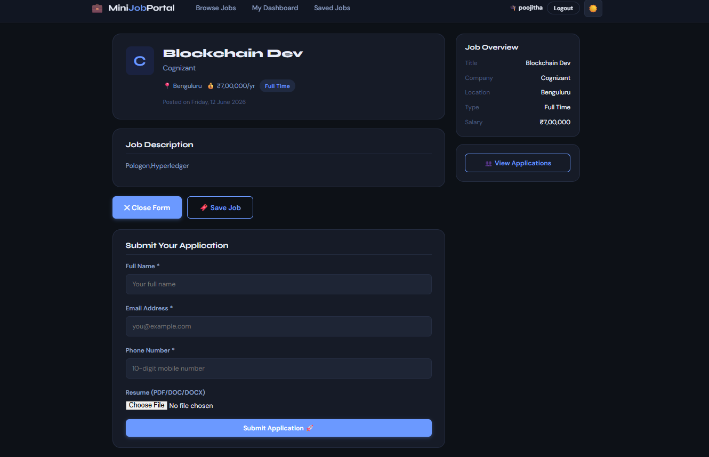
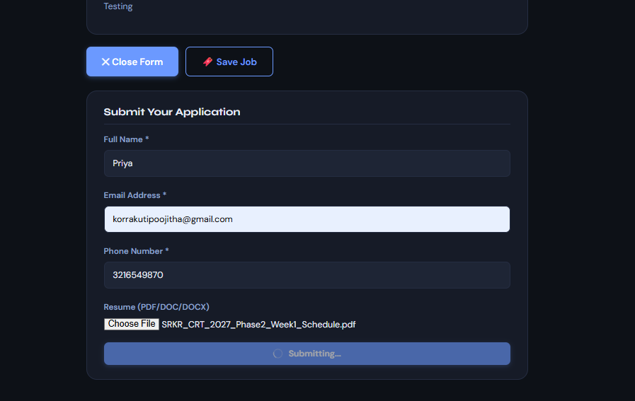
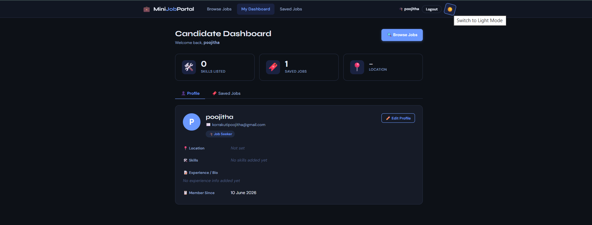
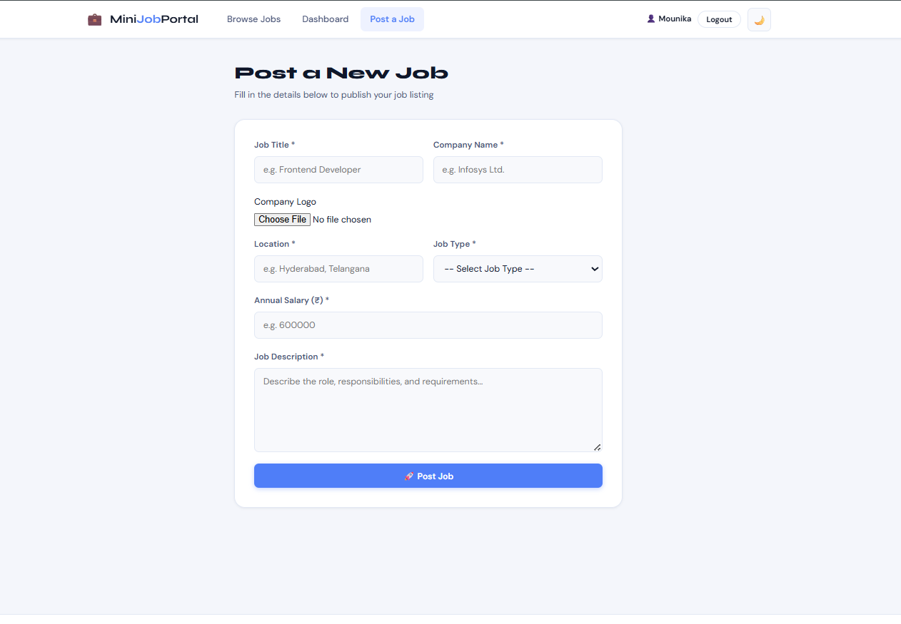
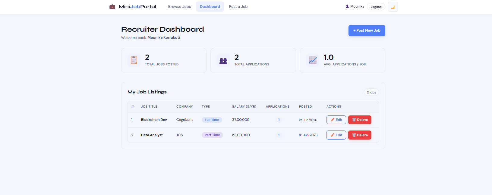
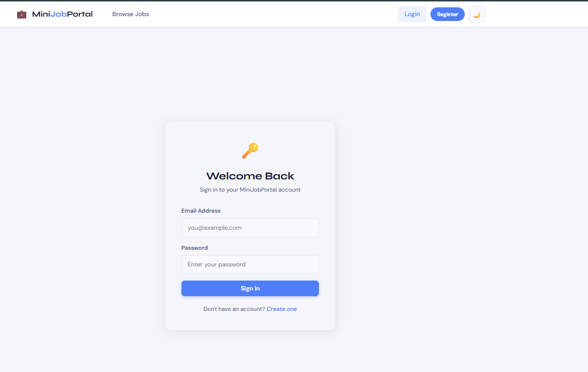
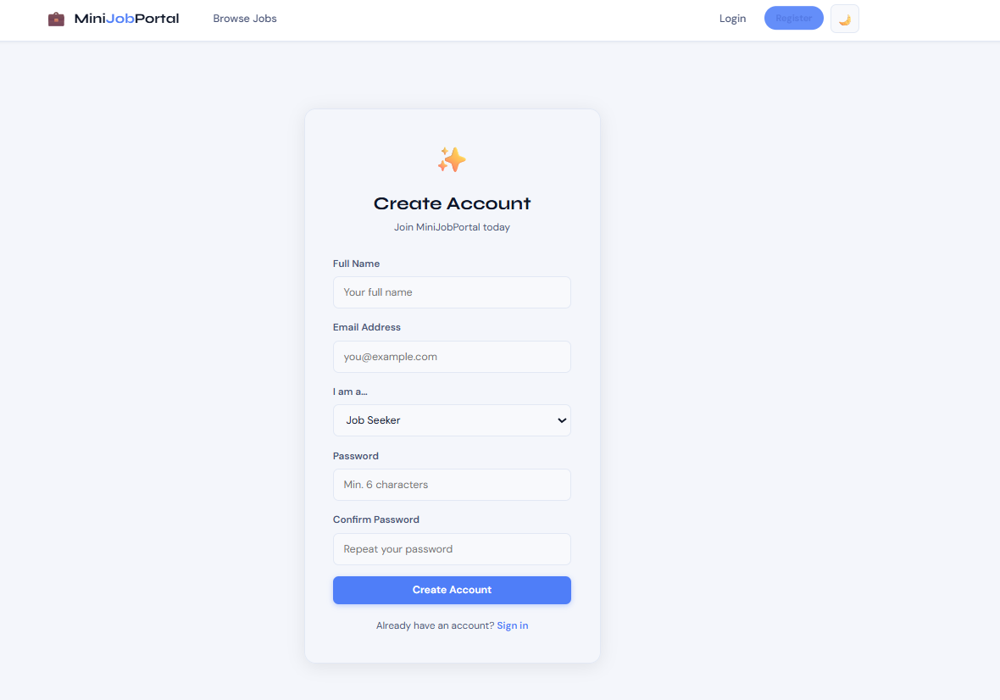
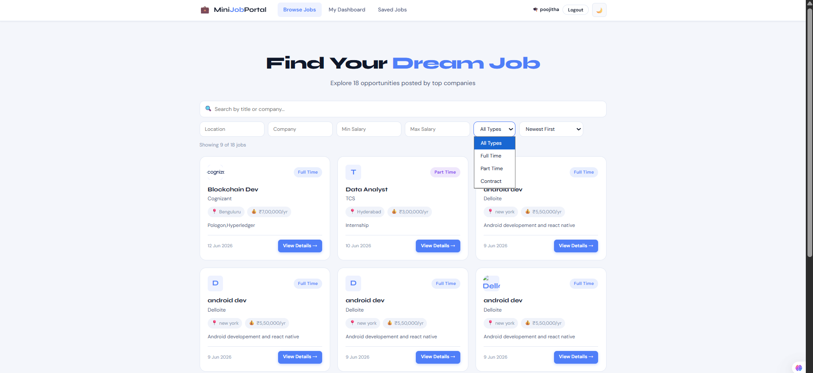
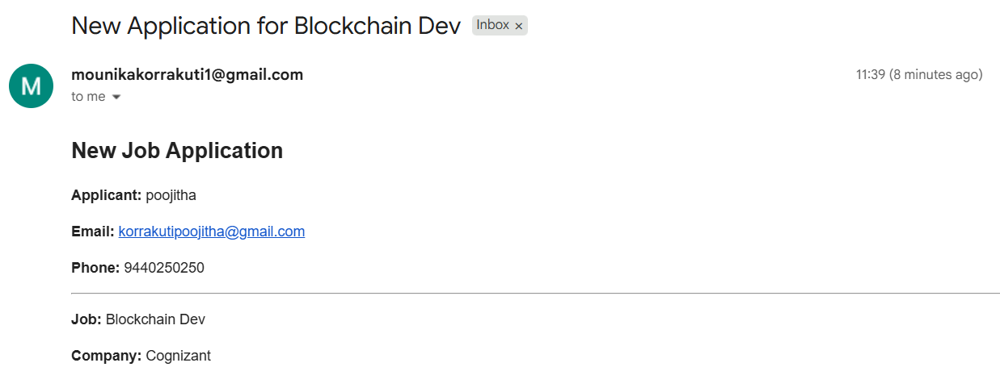
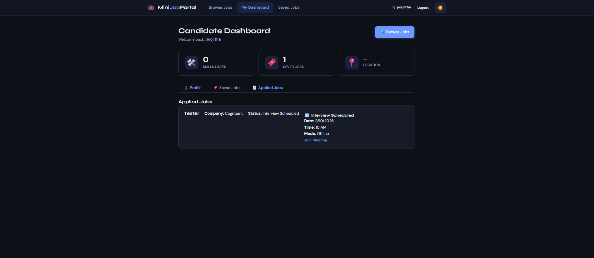

# 💼 MiniJobPortal — Full Stack MERN Job Portal

A complete **Full Stack MERN Job Portal** built using **MongoDB, Express.js, React.js, and Node.js**. The platform supports separate recruiter and candidate workflows with authentication, job posting, resume uploads, email notifications, company logos, and advanced search features.

---

## 🚀 Features

### 🔐 Authentication & Authorization
- JWT-based Authentication
- Secure Password Hashing using bcrypt
- Role-based Access Control
  - Recruiter
  - Candidate

---

### 👨‍💼 Recruiter Features
- Recruiter Registration & Login
- Post New Jobs
- Upload Company Logos
- Edit Existing Jobs
- Delete Jobs
- View Applications
- Download/View Candidate Resumes
- Recruiter Dashboard Statistics
- Email Notifications on New Applications

---

### 👨‍🎓 Candidate Features
- Candidate Registration & Login
- Browse Jobs
- Search Jobs
- Save Jobs
- Apply for Jobs
- Upload Resume (PDF/DOC/DOCX)
- Candidate Dashboard
- Edit Profile

---

### 🔎 Advanced Job Search
- Search by Job Title
- Search by Company
- Filter by Location
- Filter by Salary Range
- Filter by Job Type
- Sorting Options
- Pagination

---

### 📂 File Upload Features
- Resume Upload
  - PDF
  - DOC
  - DOCX
- Company Logo Upload
- Multer-based File Storage

---

### 📧 Email Notification System
When a candidate applies:

- Recruiter receives an email automatically.
- Email contains:
  - Applicant Name
  - Email
  - Phone Number
  - Job Title
  - Company Name

Implemented using:

- NodeMailer
- Gmail SMTP

---

### 🎨 User Interface
- Responsive Design
- Dark Mode
- Light Mode
- Modern Dashboard UI
- Mobile Friendly

---

## 🛠️ Tech Stack

### Frontend
- React.js
- React Router DOM
- CSS3
- Fetch API

### Backend
- Node.js
- Express.js

### Database
- MongoDB
- Mongoose

### Authentication
- JWT
- bcryptjs

### File Upload
- Multer

### Email Service
- NodeMailer

---

## 📂 Project Structure

```text
MiniJobPortal/
│
├── client/
│   ├── src/
│   │   ├── components/
│   │   ├── pages/
│   │   ├── services/
│   │   ├── hooks/
│   │   └── context/
│   │
│   └── public/
│
├── server/
│   ├── config/
│   ├── controllers/
│   ├── middleware/
│   ├── models/
│   ├── routes/
│   ├── uploads/
│   │   ├── resumes/
│   │   └── logos/
│   └── server.js
│
├── screenshots/
└── README.md
```

---

## ⚙️ Installation

### Clone Repository

```bash
git clone https://github.com/mounikakorrakuti1/ASSG-13.git
cd ASSG-13
```

---

## Backend Setup

```bash
cd server
npm install
npm run dev
```

Server runs on:

```text
http://localhost:5000
```

---

## Frontend Setup

```bash
cd client
npm install
npm run dev
```

Frontend runs on:

```text
http://localhost:5173
```

---

## 🔑 Environment Variables

Create a `.env` file inside `server/`

```env
PORT=5000

MONGO_URI=your_mongodb_connection_string

JWT_SECRET=your_secret_key

EMAIL_USER=your_email@gmail.com
EMAIL_PASS=your_gmail_app_password
```

---

# 📸 Project Screenshots

## 1. Candidate Job Details & Resume Upload



Candidates can:
- View complete job details
- Upload resumes (PDF/DOC/DOCX)
- Apply for jobs
- Save jobs for later

---

## 2. Saved Jobs Dashboard



Candidates can bookmark jobs and access them later from the dashboard.

---

## 3. Candidate Dashboard Profile



Manage profile information including:
- Skills
- Experience
- Location
- Saved jobs

---

## 4. Post Job Page with Company Logo Upload



Recruiters can create new job postings and upload company logos.

---

## 5. Recruiter Dashboard



Dashboard statistics include:
- Total jobs posted
- Total applications
- Average applications per job

---

## 6. Login Page



Secure JWT-based authentication system.

---

## 7. Registration Page



Role-based registration for:
- Recruiters
- Job Seekers

---

## 8. Browse Jobs Page



Features:
- Search jobs
- Filter by company
- Filter by location
- Salary filtering
- Job type filtering
- Pagination

---

## 9. Email Notification System



Recruiters automatically receive email notifications whenever a candidate applies for a job.

The email contains:
- Applicant Name
- Email
- Phone Number
- Job Details

---

## 10. Recruiter Application Management



Recruiters can:
- View all applications
- Access uploaded resumes
- Track application dates

---

## 🔒 Security Features

- Password Hashing using bcrypt
- JWT Authentication
- Protected Routes
- Role-based Authorization
- File Type Validation
- Input Validation
- Duplicate Application Prevention

---

## 📈 Future Enhancements

- Cloudinary Integration
- Resume Parsing
- Interview Scheduling
- AI Resume Screening
- Job Recommendation System
- Real-time Notifications
- Admin Dashboard

---

## 👨‍💻 Developed By

**Mounika Korrakuti**

SRKR Engineering College

Department of Computer Science & Engineering

---

## ⭐ Project Highlights

✅ JWT Authentication

✅ Role-Based Access Control

✅ Resume Upload

✅ Company Logo Upload

✅ Email Notifications

✅ Recruiter Dashboard

✅ Candidate Dashboard

✅ Saved Jobs

✅ Advanced Search & Filters

✅ Pagination

✅ Dark/Light Mode

✅ MongoDB Integration

✅ REST API Architecture

---